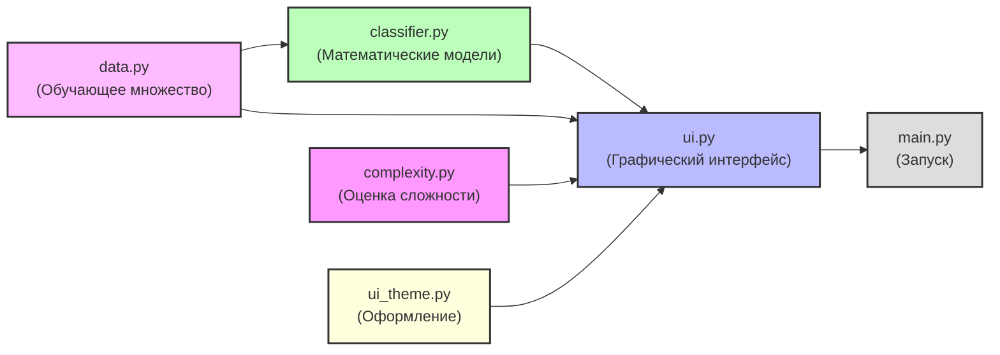

# Car Recognition — Распознавание автомобилей методами минимального расстояния и восприятия

## О проекте

Кроссплатформенное приложение на языке Python 3 с графическим интерфейсом на Tkinter и визуализацией на Matplotlib, предназначенное для решения задачи распознавания образов (pattern recognition) и поддержки принятия решений. Программа автоматизирует процесс классификации автомобилей по двум классам — «Экономный» и «Спортивный» — на основе комплексных признаков.

В ходе работы приложение последовательно реализует и сравнивает два классических алгоритма распознавания:

1. **Метод минимального расстояния** — для построения решающих функций на основе прототипов (центров) классов и определения класса объекта по максимуму решающей функции.
2. **Алгоритм восприятия (перцептрон Розенблатта)** — как итеративный метод поиска линейной разделяющей границы между классами.

Оба метода обучаются на одном и том же обучающем множестве и применяются к одним и тем же объектам, что позволяет наглядно сравнить их результаты и вычислительную сложность.

---

## Архитектура и структура проекта

Проект разделён на независимые модули, что отделяет бизнес-логику математических расчётов от графического интерфейса пользователя.

```text
car-recognition-lab/
├── classifier.py      # Классы MinDistanceClassifier и PerceptronClassifier
├── complexity.py      # Теоретические и экспериментальные оценки сложности
├── data.py            # Обучающее множество и распознаваемые объекты
├── ui_theme.py        # Тема оформления интерфейса (цвета, шрифты, стили)
├── ui.py              # Графический интерфейс и визуализация
├── main.py            # Точка входа в приложение
├── requirements.txt   # Зависимости проекта
└── README.md          # Описание проекта
```

### Взаимодействие компонентов



---

## Постановка математической задачи

Приложение по умолчанию инициализирует обучающее множество из **12 объектов** (по 6 на класс) и **5 объектов**, подлежащих распознаванию. Каждый объект описывается двумя признаками:

| Признак | Направление | Суть признака |
| :--- | :---: | :--- |
| **X1** — Расход топлива | — | л/100 км, диапазон 0…18 |
| **X2** — Мощность | — | л.с., диапазон 0…400 |

Классы: **«Экономный»** (класс 1) и **«Спортивный»** (класс 2).

### Этапы расчёта

1. **Нормирование признаков.** Приведение X1 и X2 к диапазону [0, 1] делением на максимум по каждому признаку.
2. **Обучение метода минимального расстояния.** Вычисление прототипов классов как средних арифметических точек класса: p_k = (1/N_k)·Σx_i.
3. **Построение решающих функций.** Для каждого класса k: D_k(x) = 2·(x1·p_k1 + x2·p_k2) − (p_k1² + p_k2²). Класс определяется по максимуму D_k.
4. **Обучение алгоритма восприятия.** Итеративный поиск весов w1, w2, w0 линейной разделяющей функции D12(x) = w1·x1 + w2·x2 + w0. При ошибке веса корректируются по правилу w_j ← w_j + η·y_i·x_ij.
5. **Распознавание объектов.** Для каждого из 5 заданных объектов вычисляются значения решающих функций обоих методов и определяется класс.

---

## Ключевой функционал

* **Визуализация признакового пространства.** Все точки обучающего множества окрашены по классам, прототипы отмечены звёздами, разделяющие границы обоих методов построены линиями (пунктир — метод минимального расстояния, штрих — перцептрон).
* **Интерактивное задание «своего автомобиля».** Пользователь может задать признаки собственного автомобиля через слайдеры или кликом по графику — программа мгновенно определит его класс.
* **Таблица распознавания.** Для пяти заданных объектов выводятся значения решающих функций обоих методов и итоговые классы с отметкой о согласованности.
* **Оценка вычислительной сложности.** Вкладка «Сложность» содержит теоретические оценки (O(N·d), O(K·d), O(I·N·d), O(d)), экспериментальные замеры времени обучения и распознавания, а также замеры масштабирования при N от 100 до 5000 объектов.
* **Сброс параметров.** Кнопка «Сбросить» возвращает слайдеры к значениям по умолчанию.

---

## Установка и запуск

### Системные требования

* Операционная система: Windows / Linux / macOS
* Установленный **Python 3.9** или новее
* Библиотека **matplotlib** (для визуализации)
* **Tkinter** — входит в стандартную библиотеку Python

### Инструкция по сборке

1. Клонируйте репозиторий с исходным кодом:

   ```bash
   git clone 
   cd car-recognition-lab
   ```

2. Создайте и активируйте виртуальное окружение (рекомендуется):

   ```bash
   python -m venv .venv
   # Windows:
   .venv\Scripts\activate
   # Linux / macOS:
   source .venv/bin/activate
   ```

3. Установите зависимости:

   ```bash
   pip install -r requirements.txt
   ```

4. Запустите приложение:

   ```bash
   python main.py
   ```

---

## Использование

1. При запуске открывается главное окно с вкладкой **«Признаковое пространство»**.
2. Перейдите на вкладку **«Объекты»**, чтобы увидеть результаты распознавания пяти заданных автомобилей обоими методами.
3. Перейдите на вкладку **«Сложность»** и нажмите **«▶ Замерить»** для экспериментальной оценки времени, либо **«▶ Масштабирование»** — для оценки зависимости времени от размера выборки.
4. Для интерактивной проверки задайте признаки своего автомобиля слайдерами справа или кликните по графику — результат появится в правой панели.
5. Кнопка **«Сбросить»** в шапке окна возвращает параметры к значениям по умолчанию.

---

## Результаты

После обучения на 12 объектах и распознавания 5 заданных автомобилей получены следующие результаты:

| Объект | Класс (мин. расстояние) | Класс (восприятие) | Согласовано |
|---|---|---|---|
| Городской хэтчбек | Экономный | Экономный | ✓ |
| Спорткар | Спортивный | Спортивный | ✓ |
| Кроссовер | Спортивный | Спортивный | ✓ |
| Гибрид | Экономный | Экономный | ✓ |
| Седан бизнес-класса | Спортивный | Спортивный | ✓ |

Оба метода дали согласованные результаты для всех пяти объектов.

