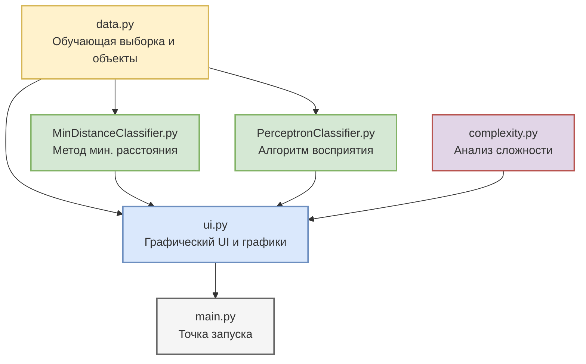

# Car Recognition

Кроссплатформенное десктопное приложение на **Python 3** с графическим интерфейсом на **Tkinter** и аналитической визуализацией на **Matplotlib**. Программа автоматизирует классификацию автомобилей по двум категориям (**«Экономный»** и **«Спортивный»**) на основе пяти комплексных признаков.

Проект разработан как демонстрационная лабораторная работа по дисциплине **«Методы распознавания образов и поддержки принятия решений»**. В приложении последовательно реализованы и сравнены два классических подхода:
1. **Метод минимального расстояния** (метрический классификатор на основе эталонов классов).
2. **Алгоритм восприятия / Перцептрон Розенблатта** (итеративный метод построения линейной разделяющей гиперплоскости).

---

## 🛠 Архитектура и структура проекта

Проект спроектирован по модульному принципу, что позволяет полностью отделить математическую бизнес-логику и данные от графической оболочки (UI).

```text
car-recognition-lab/
├── data.py                    # Исходные данные: обучающая выборка и тестовые объекты
├── MinDistanceClassifier.py   # Реализация метода минимального расстояния
├── PerceptronClassifier.py    # Реализация алгоритма восприятия (перцептрона)
├── complexity.py              # Расчет теоретической и экспериментальной сложности
├── ui.py                      # Графический интерфейс, кастомная тема и графики Matplotlib
├── main.py                    # Главная точка входа для запуска приложения
└── README.md                  # Документация проекта
```

### Диаграмма взаимодействия модулей



---

## 📐 Математическая постановка задачи

Каждый автомобиль описывается **вектором из 5 признаков**:

| Признак | Описание | Единица измерения | Максимальное значение ($X_{max}$) |
| :---: | :--- | :---: | :---: |
| **X1** | Расход топлива | л / 100 км | 18 |
| **X2** | Мощность двигателя | л.с. | 400 |
| **X3** | Объём двигателя | л | 6 |
| **X4** | Масса автомобиля | кг | 2500 |
| **X5** | Расход масла | усл. ед. | 15 |

### Математические этапы

1. **Нормирование признаков (MinMax):**  
   Для устранения разницы в масштабах осей все признаки линейно проецируются в диапазон $[0, 1]$ по формуле:  
   $$x_{norm} = \frac{X}{X_{max}}$$

2. **Метод минимального расстояния:**  
   * Вычисляются центроиды (прототипы) классов $p_k$ как среднее арифметическое объектов обучающей выборки.
   * Строятся решающие функции:  
     $$D_k(x) = 2 \cdot (x \cdot p_k) - \|p_k\|^2$$
   * Объект относится к классу с максимальным значением $D_k(x)$.

3. **Алгоритм восприятия:**  
   * Находится вектор весов $W = [w_1, w_2, w_3, w_4, w_5]$ и смещение $w_0$ разделяющей гиперплоскости:  
     $$D_{12}(x) = \sum_{j=1}^{5} w_j \cdot x_j + w_0$$
   * Настройка весов происходит итеративно при обнаружении ошибок классификации на обучающей выборке:  
     $$W_{new} = W_{old} + y_i \cdot X_i$$

---

## 🚀 Ключевые возможности приложения

* **2D-Проекция гиперплоскостей:** Визуализация признакового пространства на плоскости $(X1, X2)$. Линейные границы отображаются как срезы 5-мерного пространства при фиксированных значениях $X3, X4, X5$.
* **Интерактивный классификатор:** Возможность динамически задавать параметры «Своего автомобиля» с помощью ползунков (слайдеров) или по прямому клику мыши в любую точку графика.
* **Анализ тестовой выборки:** Автоматический расчет, сравнение и вывод результатов распознавания для 5 встроенных тестовых автомобилей.
* **Экспериментальный бенчмарк:** Вкладка анализа вычислительной сложности с возможностью динамического замера времени обучения классификаторов при масштабировании выборки от 100 до 5000 объектов.

---

## 💻 Установка и запуск

### Системные требования
* **Python 3.9** или выше
* Операционная система: Windows, macOS, Linux

### Инструкция по запуску

1. Склонируйте репозиторий с проектом:
   ```bash
   git clone <URL_ВАШЕГО_РЕПОЗИТОРИЯ>
   cd car-recognition-lab
   ```

2. Создайте и активируйте изолированное виртуальное окружение:
   ```bash
   # Для Windows:
   python -m venv .venv
   .venv\Scripts\activate

   # Для Linux / macOS:
   python3 -m venv .venv
   source .venv/bin/activate
   ```

3. Установите обязательную внешнюю зависимость:
   ```bash
   pip install matplotlib
   ```

4. Запустите приложение:
   ```bash
   python main.py
   ```

---

## 📊 Результаты работы алгоритмов

При базовом обучении на выборке из 12 объектов оба алгоритма показывают **100% согласованность** на тестовых данных:

| Тестовый объект | Класс (Мин. расстояние) | Класс (Перцептрон) | Статус |
| :--- | :---: | :---: | :---: |
| **Хэтчбек** | Экономный | Экономный | ✅ Согласовано |
| **Спорткар** | Спортивный | Спортивный | ✅ Согласовано |
| **Кроссовер** | Спортивный | Спортивный | ✅ Согласовано |
| **Гибрид** | Экономный | Экономный | ✅ Согласовано |
| **Седан** | Спортивный | Спортивный | ✅ Согласовано |
